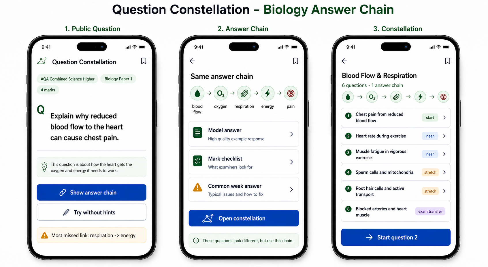
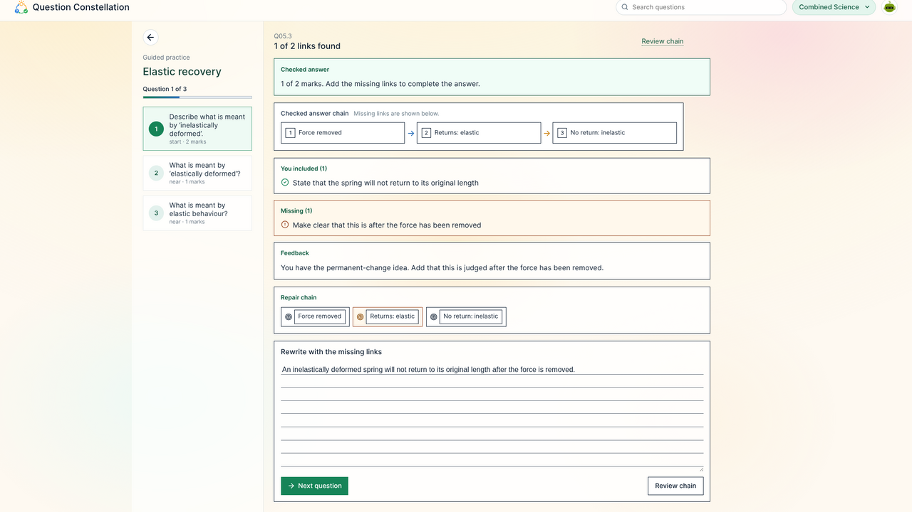
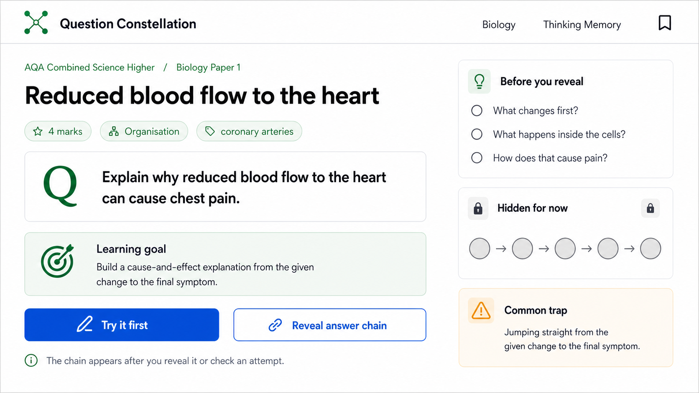
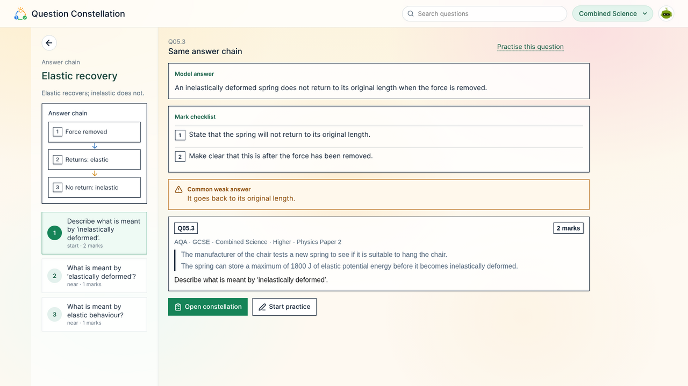
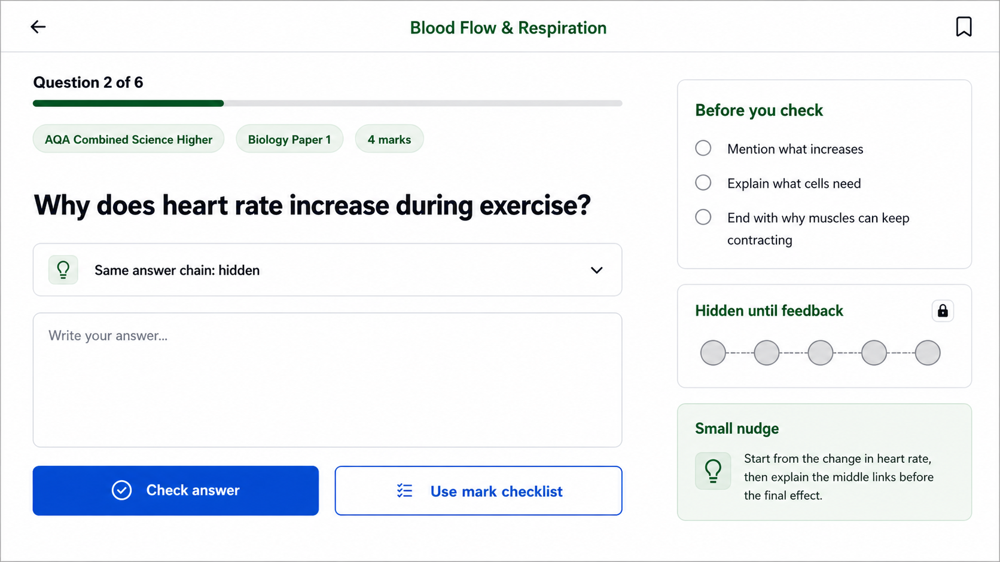
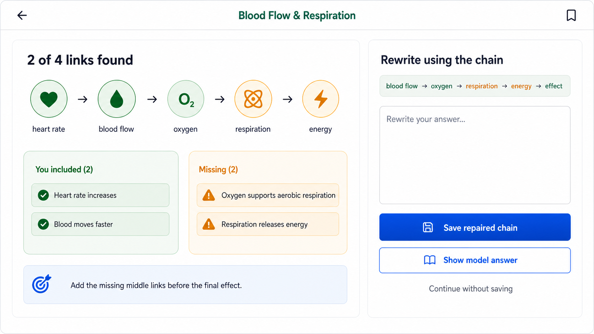
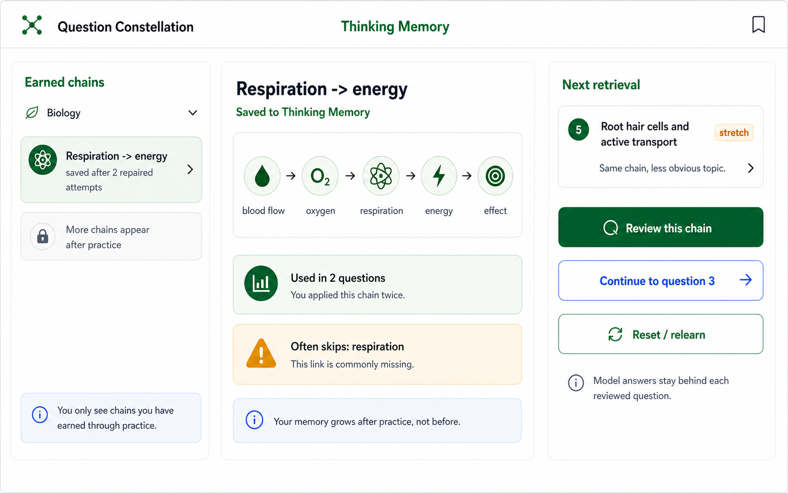

# Product Flows

Question Constellation is a lightweight GCSE exam-question atlas organized by the hidden answer chains that examiners reward. It should feel fast, public, browseable, and exam-specific. It should not feel like a generic chatbot, a heavy revision dashboard, or a broad "AI tutor" workspace.

The core promise:

> Questions that look different often use the same answer chain. Question Constellation helps students spot, practise, and remember those chains.

## Positioning

Question Constellation is built around three ideas:

1. Start from a real exam-style question.
2. Reveal the answer chain behind it.
3. Practise transfer through nearby and harder questions that use the same chain.

The first product should be closer to an exam-question atlas than a full learning operating system. Most of the value can come from curated and structured content: questions, mark checklists, common weak answers, answer chains, related questions, and model answers. Runtime model use should be optional and lightweight, mainly for explicit answer checking after the student has already tried.

## Market Signals

The research pointed to several recurring student behaviors:

- Students discover tools through short-form exam-question clips where they can argue with the answer or try solving the question.
- Creator and teacher review content builds trust, especially when it shows real exam use rather than abstract product claims.
- Search intent is highly specific: students look for a board, paper, topic, mark value, or exact question type.
- Students care whether a question is actually in their exam specification.
- Students want visible proof of why they lost marks, not only a score.
- Students want fast last-minute practice, printable sets, and post-question repair.
- Students are skeptical of vague AI feedback, stale specifications, wrong diagrams, repeated questions, and generic generated practice.

This means acquisition should send users to a specific question or chain page, not a generic homepage.

## Acquisition Flows

### 1. Short-Form Question Hook

Entry content:

- A short video or post shows one GCSE question.
- The hook is participatory: "Most students miss this 4-marker. What link is missing?"
- The content should include enough of the question for the student to attempt it mentally.

Landing page:

- Public question page.
- No sign-in wall.
- Board, paper, topic, tier, and mark value visible immediately.
- Primary action: `Show answer chain`.

Why it works:

- The student arrives already trying to solve the question.
- The page rewards that intent immediately.
- The product difference appears within the first screen: the hidden chain, not a generic explanation.

### 2. Search Result To Answer Chain

Search examples:

- "why does reduced blood flow cause chest pain gcse"
- "AQA biology respiration energy 4 mark answer"
- "GCSE heart rate exercise respiration answer"

Landing page:

- Exact question page or answer-chain page.
- Model answer, mark checklist, and common weak answer should be visible without requiring an account.
- Related questions should be framed as the same answer chain, not just "more questions".

Why it works:

- Search users have narrow intent.
- A structured page can answer faster than a chat product.
- Public pages can build organic reach over time.

### 3. Teacher Or Creator Link

Entry content:

- A teacher, tutor, parent, or student creator links to a chain page.
- The language should be practical: "Here are six Biology questions that use the same respiration-energy chain."

Landing page:

- Constellation page.
- Shows the question list, answer chain, and common missing link.
- Includes a printable or copyable practice set later, but not as the first interaction.

Why it works:

- Trust comes from a person the student already follows.
- The product page must look credible and exam-native enough to preserve that trust.

### 4. Post-Question Or Post-Exam Debrief

Entry content:

- A student asks why an answer was wrong, whether a topic is in the spec, or what the question was really testing.

Landing page:

- A debrief page for a question type or answer chain.
- Shows what the question tested, what common answers miss, and three similar questions.

Why it works:

- Students often need repair after a mistake, not more content.
- This is a natural path into the constellation: one mistake leads to a family of related questions.

## Core Product Objects

### Exam Context

Every question should carry explicit metadata:

- Qualification: `GCSE`
- Board: `AQA`
- Subject: `Combined Science`
- Tier: `Higher`
- Paper: `Biology Paper 1`
- Topic: `Organisation`
- Mark value: `4 marks`
- Question type: `explain`

This metadata is part of the trust surface. It should be visible, not hidden in internal data.

### Question

A question is the smallest public entry point. It should include:

- Prompt
- Mark value
- Exam context
- Optional diagram or source
- Model answer
- Mark checklist
- Common weak answer
- Link to its answer chain
- Link to its constellation

### Answer Chain

An answer chain is the reusable reasoning structure behind one or more questions.

Example:

```text
blood flow -> oxygen -> respiration -> energy -> pain
```

An answer chain should include:

- Plain-language title
- Chain steps
- Why each step matters
- Common missing links
- Model answer using the chain
- Question families that use it
- Review state only if a future retained-chain surface is rebuilt

### Constellation

A constellation is a curated set of questions that use the same answer chain.

Question types within a constellation:

- `start`: the first concrete question.
- `near`: same subject and close topic.
- `stretch`: same chain in a less obvious topic.
- `exam transfer`: harder exam-style transfer question.

Example Biology constellation:

1. Chest pain from reduced blood flow
2. Heart rate during exercise
3. Muscle fatigue in vigorous exercise
4. Sperm cells and mitochondria
5. Root hair cells and active transport
6. Blocked arteries and heart muscle

### Retained Chain Review

The old `/thinking-memory` route is removed from the current product. A retained-chain review surface may return later, but it should be rebuilt after practice is useful enough to create earned review state. It is not the first-use taxonomy and should not be restored as a standalone old UI.

A future version should show:

- Retained chains
- Where each chain was discovered
- Questions where the chain has been used
- Common missing link
- Review action
- Reset or relearn action

Any retained-chain surface should grow after practice, not before it.

## Primary UX Flows

### Returning signed-in learner

The signed-in home is a return surface, not an acquisition landing page. It should stay subordinate to the public question-first product loop.

1. The student arrives at home and sees a compact weekly summary, a visual challenge recommendation, and their subjects.
2. Every subject card is one obvious target with a visible action: `Open` for its activity hub, `Set up` for unconfigured subject content, or `Adjust` for a scope change.
3. The card shows one current next step chosen from the learner evidence already stored for that subject.
4. The challenge recommendation links to one playable challenge and has a separate `Explore all` route into the full challenge catalog. Challenges are a sibling product area, never a parent of a subject.
5. Opening a subject shows the recommended action first, then a small number of genuine alternatives:
   - recall a specific included topic;
   - close a confirmed knowledge gap;
   - answer a question that applies a useful answer chain.
6. If subject content is not configured, the card says `Set up` and opens the official-curriculum selection directly.
7. English Literature uses its selected OCR set texts to open `Choose an essay question`; it does not pass through the science-oriented recommendation pipeline.

Design requirements:

- Do not hide the action behind an apparently inert card.
- Keep the recommendation rationale in its one visible detail sentence. Do not add a separate
  `Why this?` disclosure or persist duplicate recommendation-explanation prose.
- Do not place duplicate configuration buttons inside and beside the same card.
- Keep subject-content settings after the subjects on mobile and in the quieter sidebar position on larger screens.
- Past-paper links belong to public acquisition and SEO surfaces, not the signed-in next-action flow.
- If no question matches a narrow curriculum selection, offer a concrete scope adjustment instead of a dead `being prepared` state.
- Preserve official specification identifiers in data, but show learner-facing topic names rather than raw codes such as `4.1` as if they were chapter numbers.

### Navigation hierarchy and canonical routes

The app has three stable top-level destinations for a signed-in learner:

- `/` is the personal home: recommendations, progress context, a challenge suggestion, and every configured subject.
- `/questions` is the global public questions catalogue.
- `/challenges` is the global challenge catalog.

These destinations live in the signed-in account menu and reappear as contextual breadcrumbs
or chips on non-leaf pages. Do not repeat `Home`, `Questions`, and `Challenges` as a permanent
signed-in topbar row. The public topbar may keep its acquisition navigation for logged-out
visitors.

Subjects are another branch from home, not children of challenges. A subject hub lives at
`/subjects/:subject`; its curriculum selection lives at `/subjects/:subject/content`. Subject
breadcrumbs therefore read `Home / Subject` or `Home / Subject / Subject content`, with a
quiet monochrome subject icon. Challenge catalog breadcrumbs read
`Home / Challenges / Subject`.

Learning endpoints describe the durable learning object in the path:

- question: `/questions/:questionId`
- answer chain for that question: `/questions/:questionId/answer-chain`
- question practice: `/questions/:questionId/practice`
- a named English practice stage: `/questions/:questionId/practice/:stepId`
- a recall session: `/recall/:subject/:activity`

Recall paths carry the subject and activity (`quick`, `flashcards`, `multiple-choice`,
`true-or-false`, or `reverse`). Query parameters are reserved for optional session filters such
as topic and stack size, plus a safe return destination. Challenge play, recall, and active
question practice remain immersive: they use a clear back or close action
instead of fitting the global navigation into the task.

Recall configuration belongs on the subject hub beside the recall action, not inside the
immersive session. `Customise deck` expands in place and offers only learner-meaningful choices:
topic, practice style, and card count. The recommended deck remains one-click when the disclosure
is closed. Card-kind taxonomy, search, progress reset, and subject selection do not belong in this
launcher. Leaving or completing a deck returns directly to its explicit context; it must never
render the configuration controls as an intermediate frame.

### Flow A: Public Question To Constellation

1. Student lands on a public question page.
2. Student reads the exam metadata and question.
3. Student taps `Show answer chain`.
4. The app reveals the chain and related learning surfaces:
   - model answer
   - mark checklist
   - common weak answer
5. Student taps `Open constellation`.
6. The app shows six questions using the same chain.
7. Student starts question 2.

Design requirement:

- This flow must work without sign-in.
- The page should be shareable and indexable.
- The product should prove itself before asking the user to create an account.

### Flow B: Constellation Practice

1. Student opens a constellation question.
2. The app shows one exam-style prompt and answer box.
3. The chain is hidden or collapsed.
4. Student writes an answer.
5. Student taps `Check answer` or `Use mark checklist`.
6. The app shows which chain links are present and which are missing.
7. Student rewrites using the chain.
8. Student continues to the next transfer question.

Design requirement:

- Checking should feel like a mark checklist, not a freeform chat.
- If model use is available, it should sit behind `Check answer`.
- The default UI should still be useful with static checklist mode.

### Flow C: Search To Chain Review

1. Student searches for a specific question type.
2. Student lands on an answer-chain page.
3. The app shows the chain, model answer, and common weak answer.
4. Student opens the full constellation.
5. Student tries a nearby transfer question.

Design requirement:

- Search landing pages should be narrow and exact.
- Avoid broad introductory copy.
- The page should answer the query immediately.

### Flow D: Retained Chain Review (Future)

1. Student opens a future retained-chain review surface after practising.
2. Student selects an earned chain.
3. The app shows:
   - chain steps
   - questions already attempted
   - common missing link
   - next review question
4. Student taps `Review this chain`.
5. The app opens a question that uses the same chain in a new context.

Design requirement:

- Retained-chain review should not become a notes folder.
- It should be a retrieval and transfer surface.

### Flow E: Relearn Or Reset

1. Student sees a retained chain with a recurring weakness.
2. Student taps `Reset / relearn`.
3. The app returns to the original concrete question and rebuilds the chain step by step.
4. Student can then retry a transfer question.

Design requirement:

- Memory must be reversible.
- Students should not be forced into practice when they need to revisit the explanation.

### Flow F: Practice Set

1. Student opens a constellation.
2. Student chooses a small practice set from the same chain.
3. The app presents a clean list of questions and mark checklists.
4. Later, the app can support print/export.

Design requirement:

- Print/export is useful, but it should not dominate the mobile screen.
- The mobile-first action is `Start question`, not `Print`.

## Screen Specifications

### Public Question Page

Purpose:

- Convert a social/search visitor into a product user by showing one concrete exam question.

Required elements:

- Product header
- Exam metadata chips
- Question prompt
- Primary CTA: `Show answer chain`
- Secondary CTA: `Try without hints`
- Common missed link note

Do not include:

- Generic homepage hero
- Bottom navigation
- Chat prompt
- Unrelated subjects

### Answer Chain Page

Purpose:

- Explain the hidden reusable structure behind the question.

Required elements:

- Chain title: `Same answer chain`
- Chain diagram
- Model answer
- Mark checklist
- Common weak answer
- Primary CTA: `Open constellation`

Do not include:

- Long essay explanation on first view
- More than one chain
- Cross-subject examples in the first-use Biology path

### Constellation Page

Purpose:

- Show that several different questions reward the same chain.

Required elements:

- Topic family title
- Count: `6 questions · 1 answer chain`
- Chain preview
- Ordered question list
- Distance labels: `start`, `near`, `stretch`, `exam transfer`
- Primary CTA: `Start question 2`

Do not include:

- Abstract graph as the main content
- Random recommended questions
- A separate subject switcher

### Attempt Question Page

Purpose:

- Let the student attempt before seeing the answer.

Required elements:

- Progress
- Exam metadata
- Question prompt
- Collapsed same-chain helper
- Answer box
- Primary CTA: `Check answer`
- Secondary CTA: `Use mark checklist`

Do not include:

- Model answer before attempt
- Full chain expanded by default
- Chat-style conversation UI

### Checklist Result Page

Purpose:

- Show exactly why marks were lost.

Required elements:

- Found links count
- Present links
- Missing links
- Short repair guidance
- Primary CTA: `Rewrite using chain`
- Secondary CTA: `Show model answer`

Do not include:

- Vague score-only feedback
- Long generated paragraph as the main result
- Internal product claims

### Retained Chain Review Page (Future)

Purpose:

- Review an earned answer chain after a rebuilt retained-chain surface exists.

Required elements:

- Retained chain title
- Chain steps
- Used-in count
- Common missing link
- Actions:
  - `Review this chain`
  - `Continue to question 3`
  - `Reset / relearn`

Do not include:

- Mixed-subject review cards during the first Biology flow
- QR codes
- Share mechanics
- Generic progress dashboard

## Mock Boards

All flow mocks live in `docs/assets/product-flows/`. The mobile boards document the
portrait-first journey. The desktop mocks document the later wide-screen direction:
keep one focused learning surface primary, use the secondary column for guidance or
state, and avoid revealing the full chain before the student has acted.

Persistent route context rails use the shared `qc-context-rail` presentation: the
same translucent semantic surface, subtle divider, theme behavior, and circular back
control. Their width, typography, contents, and collapse breakpoint stay specific to
the learning task so a source-heavy English question can remain wider than a compact
science navigation rail. Quiet dashboard sidebars and context cards are not rails and
should not inherit this surface treatment.

### Mobile: Discovery To Constellation



This board shows the first public journey:

1. Public question page
2. Answer chain page
3. Constellation page

### Mobile: Practice Follow-Up



This board shows the continuation:

1. Attempt question 2
2. Checklist result
3. Next transfer question

### Desktop: Public Question Learning



This mock shows the desktop entry point before reveal. The central content is the
specific exam question and learning goal; the side column teaches what to look for
without exposing the answer chain too early.

### Desktop: Answer Chain Reveal



This mock shows the post-reveal state: chain first, then model answer, checklist,
weak answer, and the constellation action.

### Desktop: Practice Attempt



This mock keeps the student attempt central. The chain support is present but
collapsed until the student chooses help or checks their answer.

### Desktop: Checklist And Rewrite



This mock shows feedback as chain-link evidence, not chat. Missing links lead into a
rewrite task where the answer chain is visible as a repair scaffold.

### Desktop: Retained Chain Review (Archived Mock)



This archived mock shows an older retained-chain review idea. The current app does
not expose `/thinking-memory`; rebuild this surface before making it public again.

## Content Example

Initial Biology chain:

```text
Subject: Biology
Exam context: AQA Combined Science Higher, Biology Paper 1
Topic family: Blood Flow & Respiration
Question type: 4-mark explain question
Answer chain: blood flow -> oxygen -> respiration -> energy -> pain/effect
```

Start question:

```text
Explain why reduced blood flow to the heart can cause chest pain.
```

Model answer:

```text
Reduced blood flow means less oxygen reaches the heart muscle.
The muscle cells do less aerobic respiration, so less energy is released.
This can cause chest pain because the heart muscle cannot work properly.
```

Common weak answer:

```text
Less blood gets to the heart.
```

Why it is weak:

```text
It starts the chain but misses oxygen, respiration, and energy.
```

Transfer question:

```text
Why does heart rate increase during exercise?
```

Expected chain:

```text
heart rate -> blood flow -> oxygen -> respiration -> energy
```

## Product Boundaries

First version should include:

- Public question pages
- Answer-chain pages
- Constellation pages
- Static mark checklists
- Static model answers
- Common weak answers
- Manual or generated authoring workflow
- Optional answer checking behind an explicit action

First version should not include:

- Full GCSE dashboard
- Heavy planner
- Broad chat interface
- Always-on model use
- Mandatory sign-in before value
- Multi-subject mixing inside the first-use flow
- Social sharing as a primary mobile screen

## Implementation Notes

The current app already has the right conceptual model in `docs/product-methodology.md`: subject and concrete question first, then guided reasoning, pattern naming, and transfer.

The next implementation should tighten the product around public, indexable question and chain pages:

```text
/gcse/aqa/combined-science-higher/biology-paper-1/blood-flow-respiration
/gcse/aqa/combined-science-higher/biology-paper-1/blood-flow-respiration/answer-chain
/gcse/aqa/combined-science-higher/biology-paper-1/blood-flow-respiration/constellation
```

Data should make answer chains first-class:

```text
Question -> AnswerChain -> Constellation
```

Each question should be traceable back to:

- exam context
- answer chain
- mark checklist
- model answer
- common weak answer
- transfer distance
