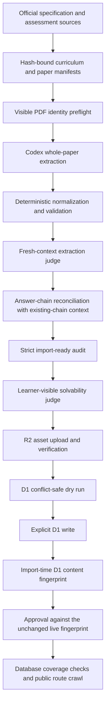

# GCSE Subject Content Workflow

This is the canonical runbook for adding, extending, repairing, refreshing, or improving GCSE subject
support in Question Constellation. Use it for a new subject or board, another paper family or series,
a stale import, a source or rendering defect, weak curriculum/card coverage, or a learner-flow
improvement.

The intended result is a repeatable source-to-publication and maintenance workflow. A successful
first import or one repaired row is not enough if it depends on hand-edited accepted JSON, one-off D1
changes, or instructions that exist only in a Codex thread.

## Read First

Before changing code or data, read:

- [AGENTS.md](../AGENTS.md) for current repository and release rules.
- [Product methodology](product-methodology.md) for the question -> answer chain -> constellation ->
  practice doctrine.
- [Product flows](product-flows.md) for public routes and learner-facing behavior.
- [Extraction specification](extraction-spec.md) for the complete source, schema, review, chain,
  solvability, R2, and D1 contract.
- [Recall practice](recall-practice.md) if the subject will also have recall or recognition cards.

The more detailed documents remain authoritative. This guide explains how to apply them throughout a
subject-content lifecycle.

## What “Subject Support” Means

Do not describe a subject as complete without stating which layers and source cohort are complete.

| Layer               | Meaning                                                                                | Required for the public question bank? |
| ------------------- | -------------------------------------------------------------------------------------- | -------------------------------------- |
| Curriculum identity | Official specification, hierarchy, offerings, tiers, options, and stable source hashes | Yes                                    |
| Assessment corpus   | Declared paper, mark-scheme, insert, source-booklet, and examiner-report cohort        | Yes                                    |
| Question atlas      | Public questions, grading evidence, answer chains, constellations, and practice routes | Yes                                    |
| Subject setup       | Subject discovery, course/option selection, topic names, and learner navigation        | Yes for a full product launch          |
| Recall cards        | Offline-generated retrieval and recognition practice                                   | Optional and separately gated          |
| Guided practice     | Subject-specific staged teaching or grading                                            | Optional and separately gated          |
| Chain illustrations | Reviewed visual explanations for eligible chains                                       | Optional; currently Science-specific   |

A one-paper canary or repair proves plumbing and quality only for that declared scope. It does not
prove that the subject, qualification, or curriculum is fully covered.

## The Architecture to Use and Extend

The production path is an automated orchestration of isolated agent phases plus deterministic gates.
Subject-specific instructions may extend those phases, but must not replace them.



The current single-paper orchestrator is
[`scripts/run-codex-production-import-pipeline.mjs`](../scripts/run-codex-production-import-pipeline.mjs).
The concurrent corpus runner is
[`scripts/run-codex-production-import-batch.mjs`](../scripts/run-codex-production-import-batch.mjs).
The extractor is agentic inside its isolated work directory: it may choose text extraction, embedded
assets, rendered pages, crops, table extraction, PDF geometry, or small helper scripts. The outer
orchestrator owns validation and all external writes.

### Non-negotiable implementation rule

When a canary, audit, production paper, or learner-flow check exposes a defect:

1. Add or improve a shared prompt rule, normalizer, schema, renderer, validator, repair operation, or
   regression fixture.
2. Rerun the affected scope from the hash-bound official source material.
3. Recheck representative unaffected content when the fix is shared.
4. Keep the failed and repaired summaries as evidence.

Do not:

- patch a production D1 row by hand;
- silently edit an accepted extraction or recall artifact;
- add a post-import rewrite that only recognizes one generated question ID;
- clear `needsHumanReview` without source evidence and rerun gates;
- weaken a gate to make one paper pass;
- treat a stale passing judge report as approval for changed data; or
- regenerate unaffected accepted model artifacts merely because a future prompt policy improved.

A source-specific guard is acceptable only when it describes a real, verified source invariant,
produces a deterministic failure, and has a fixture or durable canary artifact. The preferred fix is
the most general rule justified by the evidence.

## Choose the Operation and Freeze Its Scope

Use the same production pipeline for additions and maintenance, but make the change boundary
explicit before model work or remote writes.

| Operation                                                           | Establish before changing anything                                                                                  | Completion evidence                                                                                |
| ------------------------------------------------------------------- | ------------------------------------------------------------------------------------------------------------------- | -------------------------------------------------------------------------------------------------- |
| Add a subject, board, specification, tier, or option                | Empty-state product behavior, official curriculum identity, complete initial paper cohort, and task-shape canaries  | Declared launch cohort and product surface pass end to end                                         |
| Extend an existing corpus                                           | Existing imported sources and hashes, new source rows, overlap with existing chains, and intended additive coverage | Existing rows stay stable; every new paper has full lineage and route coverage                     |
| Refresh after a shared prompt, model, validator, or importer change | Exact affected phase/input fingerprints and the papers whose old evidence is no longer valid                        | Every invalidated phase is rerun; unaffected artifacts remain byte-identical                       |
| Repair a paper, asset, mark row, chain, or learner interaction      | Reproduction from the official source, current D1/R2 fingerprint, affected refs, and a regression boundary          | Source-derived replacement plus representative regression checks and exact post-write verification |
| Improve curriculum, recall cards, guided practice, or navigation    | Current denominator by offering/component, existing accepted artifacts, learner scope, and the specific product gap | Additive reviewed coverage or an explicitly guarded migration; no implied subject-wide completion  |

For every operation, divide the scope into:

- **replace**: exact papers, refs, chains, cards, mappings, or UI behavior intentionally changed;
- **preserve**: accepted content and runtime behavior that must remain identical;
- **revalidate**: representative neighboring content touched by a shared rule; and
- **hold out**: known unsupported or unpublishable material, with refs, marks, and reasons.

Create a versioned cohort or operation lock before expensive work. Hash the official inputs, support
documents, existing-chain context, and other phase inputs. A reusable phase is reusable only when its
recorded input root, model, thinking level, output hash, and required independent-review lineage still
match. A pipeline change must fail closed when it cannot prove that relationship.

Do not turn an update into an accidental broad refresh. Accepted extraction and card artifacts are
immutable evidence. Change them only through the declared replacement scope. Prospective prompt
improvements apply to future runs; they do not justify replaying expensive accepted runs on their own.

## 1. Declare Change Scope and Acceptance Before Coding

Record the exact launch or maintenance cohort:

- exam board and qualification;
- specification code and version;
- current and legacy specification boundaries;
- subject and any profile subject used in the product;
- foundation/higher or other tiers;
- paper components and optional routes;
- series and years to import;
- official question papers and mark schemes;
- inserts, resource booklets, pre-release material, formula sheets, anthology/source booklets, and
  examiner reports;
- expected printed atomic-question and mark totals for every manifest row; and
- known copyright-withheld or withdrawn material.

For existing content, also record:

- the current published paper/card releases and their canonical fingerprints;
- the exact source documents, question refs, chain IDs, curriculum targets, and routes to preserve;
- any legacy phase evidence that the current pipeline can or cannot authenticate;
- intended additions, replacements, withdrawals, and schema changes; and
- the production D1/R2 baseline needed for an exact after-state comparison.

Build a representative capability matrix before a large rollout. Include every shape that occurs in
the declared change and regression cohort, not merely the easiest paper:

- short and extended written responses;
- level-of-response questions;
- multiple choice and other fixed responses;
- tables, matching, formulas, code, or equations;
- diagrams, maps, graphs, drawing/plotting, and image labels;
- source extracts and parent-question context;
- previous-subpart dependencies;
- optional sections and continuation pages; and
- copyright-withheld learner sources.

Choose a small canary or regression cohort that covers the matrix. A second paper should deliberately
test cross-paper answer-chain reuse when the change can affect chains.

### Keep a coverage ledger

For each rollout wave, report at least:

- manifest papers selected, processed, passed, failed, imported, and intentionally held out;
- expected versus extracted atomic questions and marks per paper;
- questions kept and dropped, with every dropped ref and reason;
- response-kind counts;
- questions with mark rows, checklists, model answers, fixed-response keys, and chains;
- reused, created, updated, and review-blocked answer chains;
- solvability passes versus total retained questions;
- public routes and assets checked versus failed; and
- curriculum components and optional card targets covered versus still missing.

Never report only a small successful count without its denominator.

## 2. Add or Reconcile the Official Curriculum

Curriculum identity is independent of past papers. Add the official specification before mapping
questions or generating cards. For maintenance, first compare the current catalog and source hash
with the official specification; do not rewrite the curriculum for a paper-only repair.

1. Add a source row to
   [`data/curricula/source-manifest.json`](../data/curricula/source-manifest.json) with an official
   landing URL, PDF URL, version, teaching/exam dates, local path, SHA-256, and page count.
2. Download and hash the immutable PDF with
   [`scripts/download-official-curricula.mjs`](../scripts/download-official-curricula.mjs).
3. Extend
   [`scripts/build-official-curriculum-catalog.mjs`](../scripts/build-official-curriculum-catalog.mjs)
   with the subject's actual hierarchy, paper/option structure, tiers, page boundaries, and product
   offerings. Do not infer a new hierarchy by forcing it into a Science parser.
4. Update
   [`scripts/validate-official-curriculum-catalog.mjs`](../scripts/validate-official-curriculum-catalog.mjs)
   and the curriculum import/server tests. Its expected source, specification, offering, and code
   counts are intentionally explicit.
5. Rebuild, validate, then dry-run the D1 catalog import.

```sh
node scripts/download-official-curricula.mjs
node scripts/build-official-curriculum-catalog.mjs
node scripts/validate-official-curriculum-catalog.mjs
pnpm run import:curricula
```

Use `pnpm run import:curricula -- --write` only after the catalog diff and any required migration
have been reviewed and a remote write is authorized. The importer performs ownership and identity
preflights; do not bypass them.

Specification changes discovered only by comparing years belong in reviewed corpus-level curriculum
notices, not in one paper's learner-visible prompt.

## 3. Build or Reconcile a Hash-Bound Assessment Manifest

Create a deterministic downloader/discovery adapter or a versioned manifest for the corpus.
[`scripts/download-aqa-indexed-subject-papers.mjs`](../scripts/download-aqa-indexed-subject-papers.mjs)
is one board-specific example; it is not a universal parser.

The batch runner expects a `rows` array. A typical row is:

```json
{
	"board": "BOARD",
	"qualification": "GCSE",
	"subject": "Subject",
	"subject_area": "Subject",
	"tier": "Higher",
	"paper": "Paper 1",
	"component": "COMPONENT",
	"series": "June 2025",
	"year": 2025,
	"source_document_id": "board-subject-2025-june-paper-1-qp",
	"mark_scheme_document_id": "board-subject-2025-june-paper-1-ms",
	"question_paper": {
		"document_type": "question_paper",
		"title": "Official question paper title",
		"url": "https://official.example/question-paper.pdf",
		"local_path": "data/example/question-papers/paper.pdf",
		"sha256": "<64 lowercase hex characters>",
		"page_count": 24
	},
	"mark_scheme": {
		"document_type": "mark_scheme",
		"title": "Official mark scheme title",
		"url": "https://official.example/mark-scheme.pdf",
		"local_path": "data/example/mark-schemes/mark-scheme.pdf",
		"sha256": "<64 lowercase hex characters>",
		"page_count": 18
	},
	"supporting_documents": [
		{
			"document_type": "insert",
			"title": "Official source booklet",
			"url": "https://official.example/source-booklet.pdf",
			"local_path": "data/example/supporting-documents/source-booklet.pdf",
			"sha256": "<64 lowercase hex characters>",
			"page_count": 8
		}
	]
}
```

Manifest requirements:

- Prefer the exam board as the document authority. A third-party index may help discovery, but retain
  that provenance and prefer official PDF bytes when available.
- Use stable IDs derived from the visible document identity, not an unreliable download filename.
- Preserve modified, specimen, replacement, withdrawn, optional-route, and tier distinctions.
- Hash and count every PDF after download.
- Include every learner source needed to answer the paper.
- Audit visible front matter against the manifest. Extend the existing board-specific identity audit
  or add a board-neutral one; never suppress a real mismatch.
- Version the manifest or its deterministic generator even when large PDF files remain outside Git.
- For a refresh or repair, preserve the old manifest evidence and bind the operation to the exact
  intended cohort rows. Changed PDF bytes require a new reviewed source identity or version; do not
  let the same stable ID silently point at different bytes.

Extend subject normalization and help text in the batch and extraction runners when necessary.
Search for hard-coded subject allowlists rather than assuming the manifest alone registers the
subject:

```sh
rg -n "Biology|Chemistry|Physics|Computer Science|Geography|History|English" \
  scripts src
```

Replace a narrow allowlist with a catalog-derived or shared registry when that is the correct
abstraction. Keep genuinely surface-specific allowlists explicit.

## 4. Prove the Shared Data Model Can Represent the Change

The existing question schema is deliberately cross-subject. Prefer it when it faithfully represents
the source.

Supported response kinds currently include:

- `none`;
- `lines` and `labeled-lines`;
- `number-line`;
- `choice` and `choice-table`;
- `matching`;
- `equation-blanks`;
- `asset-canvas`;
- `image-label-zones`; and
- `drawing-box`, including labelled grids.

For each new or repaired task shape, verify the complete path:

1. extraction prompt and JSON schema;
2. deterministic normalization and validation;
3. D1 render overlay and answer-key import;
4. server-side hydration and types;
5. learner renderer and response serialization;
6. deterministic or model grading as appropriate;
7. learner-visible solvability context; and
8. desktop/mobile browser behavior.

Relevant shared extension points include:

| Concern                                         | Current home                                                                                                                              |
| ----------------------------------------------- | ----------------------------------------------------------------------------------------------------------------------------------------- |
| Extraction prompt and isolated tools            | [`scripts/run-codex-pdf-extraction.mjs`](../scripts/run-codex-pdf-extraction.mjs)                                                         |
| Shared extraction rules and solvability context | [`scripts/lib/llm-extraction-pipeline.mjs`](../scripts/lib/llm-extraction-pipeline.mjs)                                                   |
| Chain reconciliation                            | [`scripts/run-codex-answer-chains.mjs`](../scripts/run-codex-answer-chains.mjs)                                                           |
| Strict subset and import gate                   | [`scripts/prepare-import-ready-extraction.mjs`](../scripts/prepare-import-ready-extraction.mjs)                                           |
| D1 normalization/import                         | [`scripts/import-physics-vision.mjs`](../scripts/import-physics-vision.mjs)                                                               |
| Runtime response hydration                      | [`src/lib/server/questionExperimentData.ts`](../src/lib/server/questionExperimentData.ts)                                                 |
| Runtime response rendering                      | [`src/lib/experiments/questions/components/ResponseRenderer.svelte`](../src/lib/experiments/questions/components/ResponseRenderer.svelte) |
| Runtime grading                                 | [`src/lib/server/questionExperimentGrading.ts`](../src/lib/server/questionExperimentGrading.ts)                                           |

Despite its historical filename, `import-physics-vision.mjs` is the shared production question
importer. Do not create a parallel subject importer merely to avoid extending it.

If the subject needs a genuinely new response kind or durable field, implement it end to end and add
a migration. Do not hide an unsupported interaction in free-form metadata or flatten it to generic
text. Schema application is an explicit maintenance action, not part of an ordinary refresh.

### Grading contract

- Every retained marked question needs positive mark evidence plus a student-checkable checklist,
  model answer, fixed-response key, or reviewed chain evidence.
- Written responses need concise, source-derived student-facing model answers.
- Fixed responses need machine-readable keys and normally no model answer.
- Level descriptors and alternative routes must retain their real grading semantics.
- Exact prompt answers, dates, values, letters, and substitutions stay in question evidence, not in
  reusable answer-chain wording.

## 5. Run a Canary or Reproduction Through the Real Automated Loop

First print and inspect the plan:

```sh
pnpm run extract:production -- \
  --question-paper=data/example/question-papers/paper.pdf \
  --mark-scheme=data/example/mark-schemes/mark-scheme.pdf \
  --supporting-document=data/example/supporting-documents/source-booklet.pdf \
  --source-document-id=board-subject-2025-june-paper-1-qp \
  --subject="Subject" \
  --subject-area="Subject" \
  --paper-label="Paper 1" \
  --series="June 2025" \
  --year=2025 \
  --expected-marks=100 \
  --dry-run
```

Then run the same command without `--dry-run` and without `--import`. This performs model work,
strict audits, solvability, and a D1 conflict-check dry run, but does not write D1 or R2. For a
maintenance task, reproduce the affected paper or interaction first and include the exact preserve
and regression scope.

Production acceptance requires:

- deterministic extraction validation;
- an independent fresh-context extraction judge;
- answer-chain validation and existing-chain reconciliation;
- zero strict audit errors or warnings;
- every retained question passing learner-visible solvability;
- a safe D1 replacement plan; and
- no unresolved `needsHumanReview`.

Use the production model and reasoning defaults defined by the runner and current extraction
specification. Cost and speed are observability signals, not reasons to lower quality during subject
calibration.

Fresh and reused production phases must use the exact model and thinking policy required by the
runner. Do not reuse a passing summary created with another model, thinking level, input root, support
document set, existing-chain context, or output artifact. Real imports must keep the independent
judge, solvability, existing-D1 conflict, R2, and import-ready gates enabled.

Repair failures by changing the shared pipeline and rerunning from source. Keep the work-root
summaries, including:

- `codex-extraction-summary.json`;
- the extraction judge report and summary;
- `codex-chain-summary.json`;
- the solvability report and summary;
- `import-ready-audit.json`; and
- `codex-production-import-summary.json`.

## 6. Roll Out in Auditable Waves

Inspect a corpus plan without model calls:

```sh
pnpm run extract:production:batch -- \
  --manifest=data/example/manifest.json \
  --data-root=data/example \
  --subject=subject-slug \
  --max-papers=3 \
  --d1-existing-chains \
  --dry-run
```

For a new or expanded subject, use waves:

1. One representative canary.
2. A second paper that should reuse at least one chain.
3. A small capability-matrix wave.
4. The rest of the declared corpus.
5. Later series as incremental `--skip-imported` runs.

For a repair or shared-pipeline improvement, use a corresponding regression wave:

1. The exact failing paper/ref or learner interaction.
2. Another question with the same task shape.
3. Another paper that reuses the affected shared chain or renderer.
4. The rest of the operation lock only after those checks pass.

Existing-chain context is a snapshot created at the beginning of a batch. During initial calibration,
prefer `--concurrency=1` and rebuild D1 context between imported waves so later papers can see chains
created by earlier waves. High paper concurrency is useful after the subject vocabulary and chain
catalog are stable.

Without `--existing-chains`, `--existing-chain-input-root`, or `--d1-existing-chains`, a run that
creates every chain has not tested cross-paper reuse. Report reuse from the chain summary and verify
public route-visible multiplicity after import.

The following flags are exceptional:

- `--allow-unpublishable-source-drops` is only for narrowly identified, independently verified
  unpublishable source items.
- `--allow-shared-chain-updates` requires checking every available question already attached to the
  shared chain.
- `--allow-dropped-questions` is diagnostic and is not a normal production-completion flag.
- judge, solvability, conflict-check, or R2 skip flags are for local diagnosis, not acceptance.

## 7. Register the Product Surface

Data import alone does not make a coherent subject experience. Audit at least:

- [`src/routes/+page.svelte`](../src/routes/+page.svelte) for subject discovery;
- [`src/lib/server/subjectLearning.ts`](../src/lib/server/subjectLearning.ts) for course, option,
  unit, and learner-view behavior;
- curriculum offering and profile mappings;
- question, chain, constellation, and practice filters;
- any subject-specific command words, task kinds, grading policy, or step-by-step teaching;
- desktop and mobile layouts; and
- empty, partial, legacy-specification, and optional-route states.

Keep first use concrete: a public exam question -> answer chain -> constellation -> practice. Do not
make a new abstract dashboard or thinking taxonomy the subject's entry point.

Do not expose a subject as fully available until its declared public cohort is route-visible. If a
pilot is intentionally partial, label and report it as partial.

## 8. Treat Recall or Study Cards as a Separate Pipeline

Question extraction does not automatically create a trustworthy recall catalog.

The generic study-card catalog supports reviewed cross-subject releases; the older hand-authored
fallback remains intentionally narrow. Adding or extending a subject still requires an explicit
cross-cutting review of subject allowlists, card taxonomy, prompt, evidence model, independent
review, bundle validator, importer, learner scope, UI, and tests. Do not smuggle that feature into a
question-paper import.

For a subject where retrieval practice is useful, define the knowledge source and card types first.
For example, Literature may benefit from plot-sequence, character/theme anchor, context, and
quotation-recall cards, while essay construction remains question/chain practice. An exam-board
specification alone is not evidence for an exact literary quotation or plot detail; use a lawful,
stable primary or authorized text source and preserve exact provenance. Never invent or silently
correct a quotation.

Follow the durable compiler contract in [Recall practice](recall-practice.md):

- plan from exact official curriculum components and offerings;
- generate offline, never during a learner request;
- run deterministic validation plus independent full-card and cue review;
- preserve exact evidence, prompts, raw outputs, reviews, and artifact hashes;
- import only canonical accepted bundles from `data/recall/generated`; and
- report curriculum-target coverage and gaps rather than only the number of generated cards.

Prospective compiler-v10 recognition cards may use three or four choices. Use four only when there
are three genuinely distinct plausible misconceptions; use three instead of inventing a filler
distractor. Older accepted artifacts retain their exact versioned choice contract and must not be
regenerated only to gain variability. A content correction or identity-preserving revision remains a
separate, explicitly guarded migration.

For Literature, plot-sequence and exact quotation recall are useful alongside exam-question
practice. Ground plot and quotation cards in lawful, stable primary or authorized text sources,
preserve exact provenance, and never invent or silently correct a quotation. Essay construction and
extract analysis still belong primarily in the question -> chain -> constellation -> practice loop.

## 9. Validate Before Any Production Write

At minimum, run:

```sh
pnpm run test:extraction-pipeline
pnpm run test:chain-golden
pnpm run check
pnpm run build
```

Also run the targeted curriculum, importer, renderer, grading, subject-learning, and recall tests
affected by the change. Add a golden fixture for each new general failure mode.

Use the real browser flow for representative questions:

- compare the rendered question with the official PDF;
- verify parent context, inserts, tables, assets, and response controls;
- submit correct, partial, wrong, and blank responses;
- inspect feedback and answer keys;
- open the question, chain, constellation, and practice routes;
- check desktop and mobile; and
- apply any subject-specific validation in `AGENTS.md`, including the full English Literature
  teaching-flow protocol when applicable.

## 10. Write, Verify, and Hand Off

Remote D1/R2 writes require explicit authorization. When authorized:

1. Land the tested code, prompt, fixture, catalog, and migration changes.
2. Re-run the import command with `--import`; the orchestrator uploads referenced R2 assets before
   the D1 write.
3. Verify post-write question, overlay, mark-row, checklist, model-answer, answer-key, and chain
   coverage.
4. Capture the exact post-import D1 content fingerprint in the production summary, then verify that
   the live database still matches it before approval. A later ad hoc fingerprint is not a substitute
   for import-time provenance.
5. Crawl every public route and asset for each imported source document:

```sh
pnpm run check:public-question-routes -- \
  --source-document-id=board-subject-2025-june-paper-1-qp \
  --fail-on-error
```

6. Re-run the same import in dry-run/idempotency mode and confirm it proposes no unexplained
   mutation.
7. Return the coverage ledger, artifact paths, migration/import result, commit, and public-route
   evidence.

Never print or commit Cloudflare credentials.

## Definition of Done

A subject-content operation is done only when:

- the exact declared replace, preserve, revalidate, and hold-out scopes are recorded;
- the relevant curriculum and paper cohort are recorded;
- official source identities, hashes, and supporting documents are reproducible;
- canaries cover the subject's task-shape matrix;
- failures were fixed in the reusable pipeline and protected by tests;
- every imported question is renderable, gradable, chain-linked, and learner-solvable;
- exclusions are narrow, source-backed, and counted;
- chain reuse was tested on later papers;
- D1/R2 writes passed conflict, ownership, and post-write verification;
- the approval fingerprint exactly matches the import-time D1 content fingerprint;
- all public routes and assets passed;
- product navigation reflects the real available coverage; and
- optional recall, guided practice, and illustrations are reported separately rather than implied.

## Copy-Paste Brief for Codex

```text
Add, extend, repair, refresh, or improve <SUBJECT / BOARD / SPECIFICATION> in Question Constellation.

Treat docs/subject-content-workflow.md as the runbook and acceptance criteria. Read AGENTS.md,
docs/product-methodology.md, docs/product-flows.md, docs/extraction-spec.md, and, if recall is in
scope, docs/recall-practice.md before changing anything.

First declare the exact replace, preserve, revalidate, and hold-out scopes; bind the operation to
official source hashes; and produce a coverage ledger with denominators. Reconcile the existing
curriculum catalog, source manifest, shared production extraction orchestrator, importer, renderers,
grading, solvability, product registries, and currently published D1/R2 state. Do not create a
parallel one-off importer, hand-edit accepted artifacts, patch D1 rows, or weaken publication gates.

Run a small representative canary or exact defect reproduction without production writes. Turn every
defect into a shared prompt, schema, normalizer, renderer, validator, repair operation, or regression
fixture, then rerun the affected scope from official sources. Preserve unrelated accepted artifacts.
Test cross-paper chain reuse in a later wave and keep explicit denominators for papers, questions,
marks, response kinds, grading evidence, chains, routes, curriculum targets, and held-out material.

Do not infer permission for remote D1/R2 writes or deployment. If those writes are explicitly
requested, perform them only after all gates pass, then verify database coverage, idempotency, every
public route, every referenced asset, and exact live equality with the import-time content
fingerprint.
```
